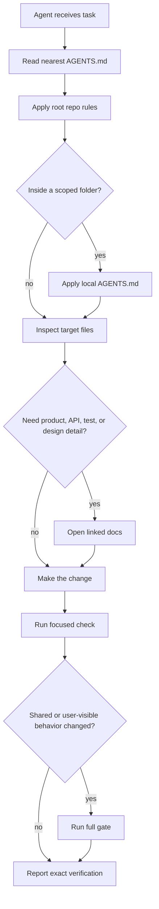

---
paths:
  - '**'
---

# How to Structure Coding-Agent Instructions in a Large Codebase

A practical layout for AGENTS.md, CLAUDE.md, Copilot instructions, scoped folder rules, and docs when several agents work in the same repo.

One coding agent can survive on a long prompt. A large codebase with several agents cannot.

When Codex, Claude Code, Copilot, and subagents all touch the same repo, the hard problem is not
which tool is smarter. The hard problem is instruction ownership. Each tool starts from a different
file, reads a different slice of the tree, and may enter the work from a different folder.

If every tool gets a full copy of the repo rules, the copies drift. One agent keeps the Bun
toolchain. Another reintroduces `ts-node` because its file was stale. One agent respects generated
SDKs. Another edits generated output because that warning lived somewhere else.

The fix is to structure instructions by scope.

<Decision title="Structure instructions by scope">
  Put shared repo rules in one canonical file. Put tool-specific files in place only to help tools
  find that file. Put local rules beside the folder that owns the local risk. Put product, API,
  test, and design detail in docs.
</Decision>

### What each file means

The filenames are not magic. They are entry points for different tools and different kinds of
context.

`AGENTS.md` is the repo contract. It tells any coding agent how to work in this repository: stack,
commands, style, naming, generated-file boundaries, protected files, and verification.

`CLAUDE.md` is the file Claude Code commonly looks for. It should not become a second contract. In
most repos, it should point to `AGENTS.md` and explain that the real rules live there.

`.github/copilot-instructions.md` is the custom instruction file GitHub Copilot reads in many
GitHub-backed projects. It should also point to the same repo contract.

`docs/` is where longer explanations live. Product behavior, route behavior, test strategy, release
notes, and design rules belong there because they are too detailed for a file every agent must read
before every edit.

A scoped `AGENTS.md` is a local rule file. It belongs under a folder only when that folder has rules
that do not apply to the whole repo.

```txt title="common instruction layout"
repo/
  AGENTS.md                         # shared repo rules
  CLAUDE.md                         # Claude Code entry point
  .github/copilot-instructions.md   # Copilot entry point
  docs/
    README.md                       # docs map
    api.md                          # route and request/response behavior
    testing.md                      # test commands and coverage map
    architecture.md                 # deeper system decisions
  apps/api/AGENTS.md                # local backend rules, only if needed
  apps/web/AGENTS.md                # local frontend rules, only if needed
  deployment/AGENTS.md              # local deploy/secret rules, only if needed
  generated/AGENTS.md               # generated-code boundary, only if needed
```

The layout is boring on purpose. The next agent should not have to guess which instruction file is
true.

### Root rules are shared rules

The root `AGENTS.md` should answer the questions every agent needs before editing code.

Examples:

- Which runtime and package manager does this repo use?
- Which command starts local development?
- Which command builds the production artifact?
- Which command runs tests, lint, format, and typecheck?
- What files are generated and must not be hand-edited?
- What code style rules are stricter than the formatter?
- What boundaries should an agent avoid unless the task is about that boundary?

For a Bun and TypeScript repo, a useful root section might look like this:

```md title="AGENTS.md"
## Stack

- Bun is the runtime, package manager, script runner, and test runner.
- Use `tsgo` for typechecking.
- Do not add `typescript`, `tsc`, `ts-node`, or `tsx`.

## Generated files

- Do not hand-edit generated route trees, generated SDK clients, or generated schema output.
- Fix the source route, schema, or generator, then regenerate.
- Update consumers to the current contract. Do not add legacy aliases to hide type errors.

## Verification

- For a small content change, run the focused content test.
- For shared route, config, or build changes, run test, typecheck, lint, and build.
```

That kind of rule changes behavior. A vague line like "write clean code" does not.

<Principle title="A rule should change a diff">
  A good instruction tells an agent what to do, what not to touch, or what command proves the work.
  If a line cannot change a future diff, move it to docs or delete it.
</Principle>

### Tool files are adapters

Tool-specific files exist because tools search for different names.

That does not mean each tool gets its own rulebook.

A good `CLAUDE.md` can be tiny:

```md title="CLAUDE.md"
Read AGENTS.md first. This file exists because Claude Code looks here.

Do not duplicate repo rules in this file. If a rule changes, update AGENTS.md.
If the task needs product behavior, API routes, testing strategy, or design rules,
open the docs linked from AGENTS.md.
```

A good Copilot instruction file can be just as small:

```md title=".github/copilot-instructions.md"
Use AGENTS.md as the source of truth for repo rules, code style, commands,
generated-file boundaries, and verification.

Do not repeat those rules here. Keep this file as a pointer so Copilot and
other agents read the same contract as humans.
```

The point is consistency. If one tool reads Claude instructions and another reads Copilot
instructions, both still land on the same repo contract.

<Tradeoff title="Pointer files give up detail to prevent drift">
  A pointer file has almost no local detail. That is the point. It keeps tool discovery working
  without creating another place where old rules can survive.
</Tradeoff>

### Local rules belong near local risk

Scoped instructions are useful when a folder has a risk the whole repo does not share.

A backend app may need rules about auth, request context, database migrations, queues, or generated
OpenAPI clients. A frontend app may need rules about generated SDK hooks, route params, UI states,
or browser-only code. A deployment folder may need rules about rendered templates and secrets.

Put those rules near the folder.

```md title="apps/api/AGENTS.md"
## Backend API rules

- Validate request bodies at the route boundary.
- Keep auth decisions in the auth module, not in random handlers.
- Queue slow work instead of doing it inside the HTTP request path.
- Regenerate the OpenAPI spec after changing public route schemas.
```

```md title="apps/web/AGENTS.md"
## Frontend app rules

- Use the generated SDK types instead of duplicating response shapes.
- Keep loading, empty, error, and success states visible in user flows.
- Do not hide server errors behind generic text until the error has been logged.
- Route params and search params must be typed at the route boundary.
```

```md title="deployment/AGENTS.md"
## Deployment rules

- Edit source templates, then regenerate rendered output.
- Never print secret values in logs.
- Make scripts idempotent so reruns are safe.
- Compare generated output before committing.
```

Those examples are common across codebases. They are not about one personal folder name. They are
about ownership boundaries.

### Docs explain the system

The root rule file should link to docs, not absorb them.

An "API flow" doc is just a plain-English map of how requests move through the app. In a web
codebase, it usually answers:

- Which URL maps to which route handler?
- What request body, query params, or headers does it accept?
- What response shape does it return?
- Which auth or rate-limit rule applies?
- Which tests prove that path?

For example:

```md title="docs/api.md"
| Route                    | Handler                      | Behavior                                                       |
| ------------------------ | ---------------------------- | -------------------------------------------------------------- |
| POST /api/comments/:slug | routes/api/comments/$slug.ts | Validates comment body, stores it, returns the public comment. |
| GET /api/comments/:slug  | routes/api/comments/$slug.ts | Returns comments for the entry.                                |
| GET /p/:slug.md          | routes/p/{$slug}.md.ts       | Returns raw markdown for a published post.                     |
```

A testing doc is the same idea for verification:

```md title="docs/testing.md"
## Route changes

Run the focused route test first. Then run typecheck and build if the change affects shared route
types, loaders, server handlers, or generated route files.

## Content changes

Run the content quality test. If the change touches MDX components, also run typecheck.
```

Docs can be longer because an agent opens them only when the task needs that context. The root
contract stays readable.

### The agent path

The work path should be deterministic.



This path matters when several agents work at once. One agent can rewrite content. Another can fix
tests. Another can inspect generated SDK drift. They all start from the same shared rules, then load
the local context their task needs.

### What belongs where

Use this split:

<Flow
items={[
'Put repo-wide rules in root AGENTS.md.',
'Keep CLAUDE.md and Copilot instruction files as pointers.',
'Add scoped AGENTS.md files only where the folder owns a real local risk.',
'Put product behavior, API routes, testing maps, and design rules in docs.',
'Update instructions when a durable rule changes, not when one task needs a temporary note.',
]}
/>

The practical rule is simple: write instructions where the next agent will need them.

If every task needs the rule, put it in the root. If only one folder needs it, put it in that folder.
If the text explains product behavior, API behavior, testing, or design intent, put it in docs and
link it. If a file exists only because a tool searches for that filename, keep it as a pointer.

That is why the structure exists: multiple agents, one large codebase, less drift, and local context
loaded exactly where it matters.
