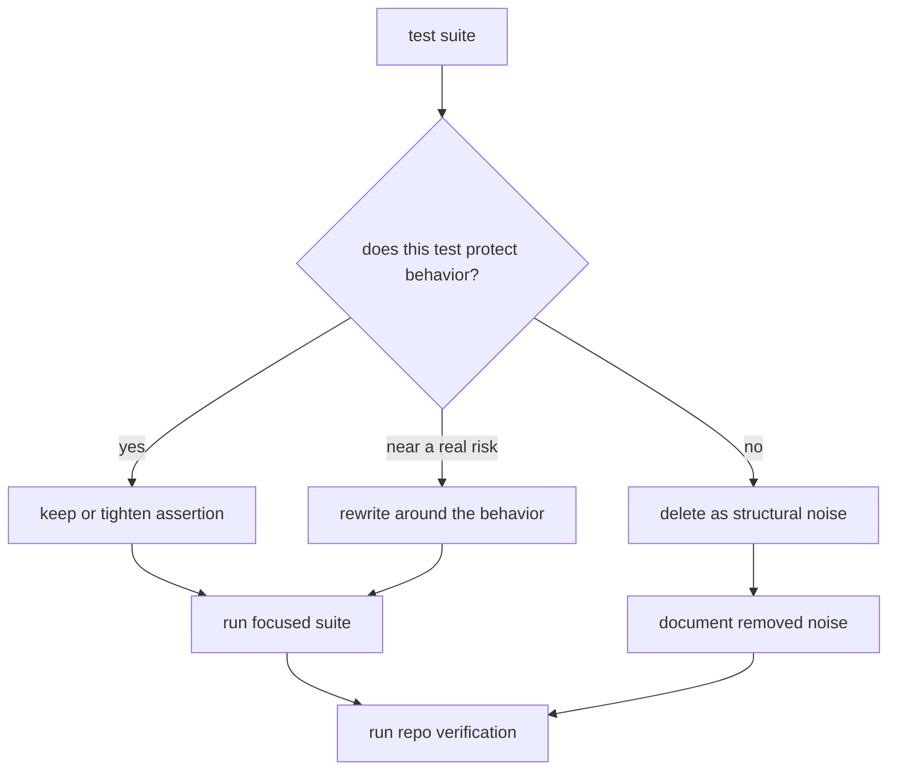

# Remove trivial tests before they harden

An agent skill for replacing shallow AI-written coverage with tests that can catch real regressions.

AI can add tests faster than a reviewer can read them. That is useful only when the tests protect a
behavior the product depends on.

This skill is for the cleanup pass after a repo has accumulated shallow coverage: existence checks on
typed imports, config snapshots that only mirror constants, mock-echo assertions, and component tests
that render without exercising a user path. Those tests make CI look calmer while leaving the real
risk untouched.

## When I Use It

Use it when a suite has grown but confidence has not:

- A test can pass even if the feature is broken.
- The assertion repeats TypeScript, schema, or framework guarantees.
- Mocks return the exact value they were handed.
- Snapshot noise blocks refactors without protecting behavior.
- Coverage increased, but the risky edge cases are still untested.

The rule is not "delete tests." The rule is: every test should be able to fail for a real regression.
If it cannot, rewrite it around the behavior or remove it and say what coverage is still missing.

```yaml title="skills/remove-trivial-tests/SKILL.md"
name: remove-trivial-tests
description: Use when a test suite has shallow coverage that cannot catch a product regression.
method:
  - classify each test by the behavior it protects
  - keep tests that guard user paths, boundaries, regressions, or integrations
  - rewrite tests that assert structure but are near a real risk
  - delete tests that only prove typed code exists
  - run the narrow suite and the repo verification command before calling it done
```



<Principle title="Coverage is not the product">
  A test earns its place when it protects behavior, a regression, or a boundary. If it only proves a
  typed file exists, it is maintenance noise wearing a green badge.
</Principle>

## The Agent Contract

The agent has to produce a verdict per test. No broad deletion pass, no "coverage cleanup" commit that
quietly removes useful guards.

The verdicts are:

- **Keep:** the test protects behavior, a boundary, an integration, a bug that came back once, or a
  security/permission rule.
- **Rewrite:** the test is aimed at a useful area but asserts the wrong thing.
- **Delete:** the test only proves a file, type, config key, export, or mock wiring exists.
- **Flag:** the behavior matters, but the test needs product context or fixtures the agent should not
  invent.

<Decision title="Name the risk before adding or keeping a test">
  I want the agent to say the failure mode in plain language first. If the failure mode is "the
  import might not exist," the compiler already owns that. If the failure mode is "a paid user can
  lose access after a retry," the suite should protect it.
</Decision>

## Prompt Shape

I usually give the agent a bounded prompt like this:

```md title="prompt/remove-trivial-tests.md"
Review the tests touched by this branch.

For each test, return one verdict: keep, rewrite, delete, or flag.

Keep tests that can fail for a meaningful product, integration, permission, parsing, retry,
billing, data-write, or regression bug.

Delete or rewrite tests that only assert:

- imports exist
- typed values are defined
- config keys mirror constants
- mocks echo their input
- components render without a user-visible behavior

Before editing, name the behavior each kept or rewritten test protects.
After editing, run the narrow test target and the repo verification command.
Report what was removed, what was rewritten, and what risk remains uncovered.
```

<Tradeoff title="Deleting noise can expose missing coverage">
  That is the point. A hollow test can hide the fact that an important behavior has no guard. The
  cleanup is only done when fake confidence is gone and the important gap is either covered or
  called out clearly.
</Tradeoff>

## What Good Looks Like

A good pass leaves fewer tests, but a stronger suite. It should be easier to answer:

- What behavior does this file protect?
- Which failures would stop the branch?
- Which checks belong to TypeScript, lint, schemas, or build instead of a test?
- Which important paths still need fixtures, integration coverage, or a better harness?

For AI-assisted development, this becomes a house rule: the agent can add a test only after it names
the risk. If it cannot say what regression the test would catch, it is probably writing decoration.
